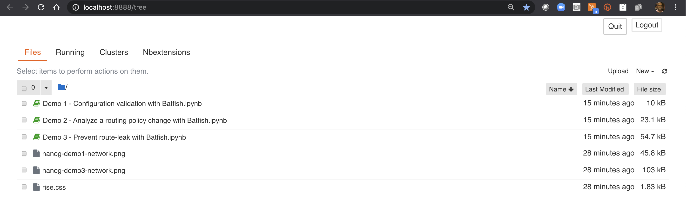

## Material for my NANOG 78 presentation and demo - Make route-leaks history: validate BGP policy with Batfish

This repository has all of the material that was part of my NANOG78 session. 

To get started with Batfish, follow the setup instructions from: 
https://batfish.readthedocs.io/en/latest/getting_started.html#installing-batfish

I highly recommend that you leverage a Python 3 virtual environment for installing the dependencies of this repository. Details on how to set one up can be found [here](https://docs.python.org/3/library/venv.html). Once your virtual environment is setup and activated, upgrade pip and then install the necessary python modules.

```
python3 -m pip install --upgrade pip
python3 -m pip install -r requirements.txt
python3 -m pip install --upgrade git+https://github.com/batfish/pybatfish.git
```

### Presentation

The slides from my presentation can be found [here](https://github.com/saparikh/nanog78/blob/master/presentation/nanog78-presentation.pptx?raw=true)

### Demonstrations

The 3 demos can be run locally by executing the Jupyter notebooks. Jupyter documentation can be found [here](http://jupyter.org/). There is a plugin for Jupyter called [Rise](https://rise.readthedocs.io/en/maint-5.6/) which I used to turn the notebooks into a slideshow. You will need to install that if you want to do the same. But that is not necessary for you to simply run through the demo scenarios.


To run the demos, execute the following commands
```
cd notebooks
jupyter notebook
```

A browser tab will open from where you can select the demo notebook to run.



#### Demo 1 - Configuration validation with Batfish.ipynb

Introduction to the basics of Batfish and how to evaluate Batfish policies.

#### Demo 2 - Analyze a routing policy change with Batfish.ipynb

Comparing routing policy differences between two snapshots

#### Demo 3 - Prevent route-leak with Batfish.ipynb

Evaluating a chance to routing policy to ensure it doesn't result in a route-leak
